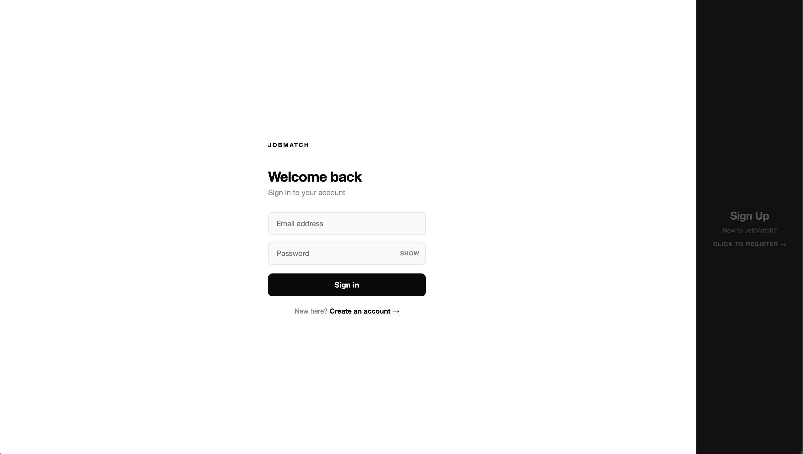
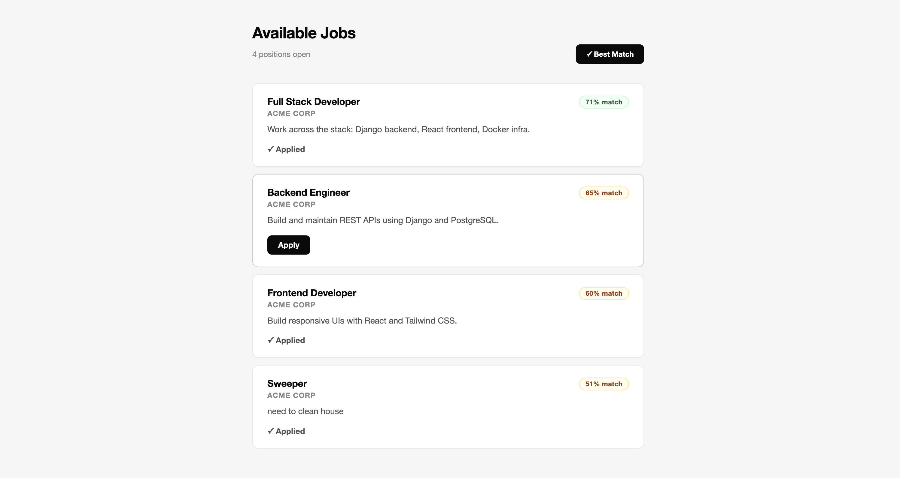
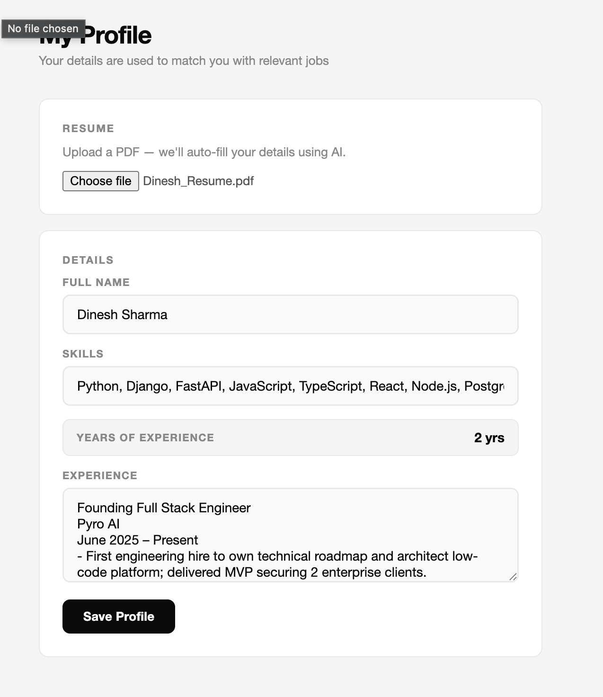
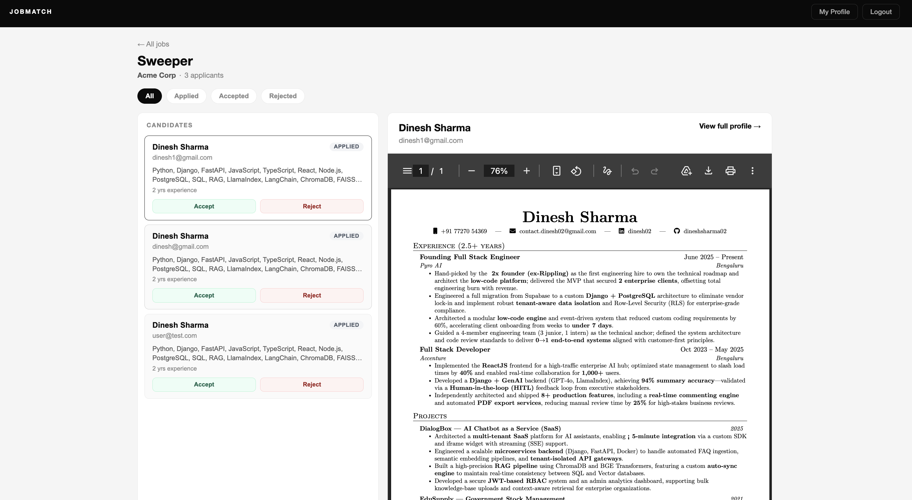
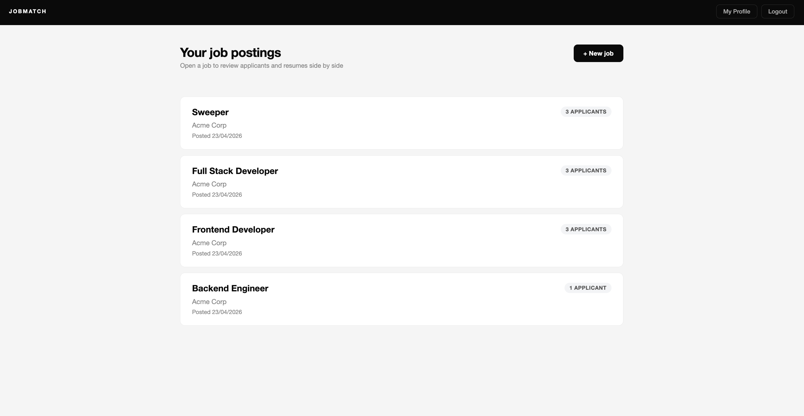

# Job Platform — AI‑Powered, Vector‑Search Hiring, Built Simple

> A full‑stack hiring platform where candidates upload a resume once and instantly see **the jobs that actually match them**, ranked by semantic similarity — not keywords. HR posts a role, clicks once, and sees a ranked, explainable list of applicants with their parsed resume, skills and years of experience.

Built with **Django + DRF + PostgreSQL + React (Vite) + Docker**, with **Google Gemini embeddings** powering the vector search and the resume parser.

---

## Quick Start — One Command

```bash
git clone <your-repo-url> job-platform && cd job-platform
docker compose up --build
```

### Optional — Google Gemini (vector search & resume parsing)

Add a `.env` file in the project root (next to `docker-compose.yml`):
Attached my free personal key for making efforts lesser

```bash
GEMINI_API_KEY=your_google_ai_studio_key
```

The app still runs without a key — the AI features are no‑ops and job ordering falls back to newest first. 

**If embeddings, parsing, or autofill do not work:** (1) the variable is missing or the containers were not rebuilt after you added `.env`, or (2) Google AI account or API is **rate limited** due to load or many requests.

**Resume files:** this build is only tested for **PDF**; **DOCX** and other formats are not supported.

When the containers are up:

| Service   | URL                                            |
| --------- | ---------------------------------------------- |
| Frontend  | http://localhost:5173                          |
| Backend   | http://localhost:8000/api/                     |
| Admin     | http://localhost:8000/admin/                   |
| Postgres  | localhost:5432 (inside Docker network as `db`) |

### Test Credentials (auto‑seeded on first boot)

| Role      | Email            | Password    |
| --------- | ---------------- | ----------- |
| HR        | admin@test.com   | Admin@1234  |
| Candidate | user@test.com    | User@1234   |

Three sample jobs are seeded for HR `admin@test.com` so candidates have something to browse out of the box.

---

## Why This Matters — For Candidates

Job boards are broken for candidates. You upload the same resume everywhere, type the same keywords, and still scroll through hundreds of roles that don't fit.

This project flips that around:

- **Upload your resume once.** The backend extracts text from the PDF, asks Gemini to parse out your name, skills and years of experience, and stores a 3072‑dimensional embedding of the full resume.
- **See jobs ranked for *you*.** Hit "Best match" and every open role is scored (0–100) against your resume embedding using cosine similarity. The best fits rise to the top, instantly.
- **No keyword gymnastics.** "Built REST APIs in Python" matches a role asking for "Django microservices" — because the meaning is the same, even when the words aren't.
- **Zero friction to apply.** One click. HR sees your parsed profile, your resume PDF inline, and your match score.

For HR, the same vector index means applicant lists are already enriched with structured skills and experience — no more reading 200 PDFs to find the 5 worth a call.

---

## Architecture

```
          ┌──────────────────┐          ┌──────────────────┐         ┌──────────────┐
Browser → │  Frontend (5173) │ ──/api── │  Backend (8000)  │ ──SQL── │ Postgres(db) │
          │  React + Vite    │ ──/media │  Django + DRF    │         │  jobplatform │
          │  JWT in storage  │          │  SimpleJWT       │         │              │
          └──────────────────┘          └────────┬─────────┘         └──────────────┘
                                                 │
                                                 ▼
                                       ┌────────────────────┐
                                       │  Google Gemini API │
                                       │  • embedding-001   │  (resume + job → 3072‑dim vector)
                                       │  • 2.5‑flash‑lite  │  (resume PDF → structured JSON)
                                       └────────────────────┘
```

- **Single Docker network** connects all three services. The frontend talks to the backend via Vite's dev proxy (`/api` and `/media`) so the browser only ever sees `localhost:5173` — which keeps PDF iframes, auth cookies, and CORS all sane.
- **Persistent volume** `postgres_data` keeps your database across `docker compose down`.
- **Healthcheck + `depends_on`** ensure the backend only starts migrations after Postgres is actually ready.
- **Auto‑seed on boot** runs `makemigrations → migrate → seed` every time the container starts; the seed is idempotent (uses `get_or_create`), so re‑runs are safe.

---

## Feature Walkthrough (STAR Format)

Each feature below is described in the STAR format — **S**ituation, **T**ask, **A**ction, **R**esult — so you can evaluate *why* each piece exists, not just *what* it does.

### 1. Semantic ("Best‑match") Job Ranking

- **Situation:** Candidates see dozens of jobs; keyword filters miss 80% of the real matches.
- **Task:** Rank the job list by genuine semantic similarity to the candidate's resume.
- **Action:** On resume upload, the backend extracts PDF text with `pypdf`, generates a Gemini `gemini-embedding-001` vector, and stores it on `CandidateProfile.resume_embedding`. Each job gets the same treatment at post time (`Job.description_embedding`). The `/api/jobs/?sort=relevance` endpoint computes cosine similarity in Python and returns jobs with a `match_score` (0–100).
- **Result:** Candidates hit **Best match** and instantly see the top‑fit jobs first, each tagged with a percentage score. Zero keyword tuning required.

### 2. One‑Shot Resume Parsing with Gemini

- **Situation:** Making candidates re‑type their skills, years of experience and work history is the #1 abandonment point in job platforms.
- **Task:** Auto‑fill the candidate profile from a single PDF upload.
- **Action:** After PDF text extraction, `parse_resume_with_gemini` prompts `gemini-2.5-flash-lite` to return strict JSON with `full_name`, `years_of_experience`, `skills`, and a structured `experience` summary. The response is validated and merged into the `CandidateProfile`.
- **Result:** Candidates go from "zero profile" to "fully populated, AI‑summarised profile" in under 10 seconds. HR sees clean, comparable data across applicants.

### 3. JWT Auth with Two Roles

- **Situation:** HR and candidates need completely different views, permissions, and data.
- **Task:** One auth system, two clearly separated roles with no privilege escalation.
- **Action:** Custom `User` model with a `role` field (`hr` / `candidate`). JWT access/refresh tokens via `djangorestframework-simplejwt`. `IsHR` and `IsCandidate` DRF permission classes guard every endpoint. The frontend's `ProtectedRoute` gates pages on token + profile completeness.
- **Result:** `admin@test.com` can post jobs and review applicants; `user@test.com` can apply and nothing else. 401/403 are enforced at the API, not just hidden in the UI.

### 4. HR Dashboard with Applicant Triage

- **Situation:** HR posts a job and gets flooded — they need to sort, skim, and decide fast.
- **Task:** Give HR a single pane with job → applicants → resume → accept/reject.
- **Action:** `/dashboard` lists HR's jobs with applicant counts (`annotate(Count('applications'))`). Drill into a job to see every applicant with their parsed name, skills, years of experience, and an **inline PDF preview** of their resume. Status (`applied / accepted / rejected`) updates via a PATCH.
- **Result:** HR triages a full pipeline without ever leaving the dashboard or downloading a file.

### 5. Secure Applicant Detail View

- **Situation:** HRs must not be able to peek at candidates who didn't apply to their jobs.
- **Task:** Authorize candidate profile access strictly through the application relationship.
- **Action:** `CandidateHRDetailView` checks `Application.objects.filter(user_id=..., job__created_by=request.user).exists()` before returning anything. Any direct `/api/auth/candidates/<id>/` hit without a linking application returns `404`.
- **Result:** No horizontal privilege escalation. HRs only ever see applicants for their own jobs.

### 6. Single‑Command Docker Orchestration

- **Situation:** Assessors shouldn't need Python, Node, Postgres or any local tooling installed.
- **Task:** Make the whole stack bootable from a fresh machine with one command.
- **Action:** `docker-compose.yml` defines `db` (with healthcheck + named volume), `backend` (runs `makemigrations → migrate → seed → runserver`), and `frontend` (Vite on `0.0.0.0:5173` with proxy to `backend:8000`). Service discovery happens via Docker's internal DNS.
- **Result:** `docker compose up --build` → working app on `localhost:5173`. No README gymnastics.

### 7. Input Validation, End‑to‑End

- **Situation:** Bad input shouldn't crash the server or corrupt the DB.
- **Task:** Validate at the serializer layer and the form layer.
- **Action:** DRF serializers enforce required fields, min password length, unique emails, and role choices. The frontend blocks empty submissions, bad passwords, and non‑PDF uploads before they ever hit the API.
- **Result:** Clean 400s with actionable error messages — not 500s.

### 8. Automated Test Suite

- **Situation:** Changes must not silently break auth or permissions.
- **Task:** Cover the critical paths — signup, login, job create, apply, list‑own‑applications — with integration tests.
- **Action:** `pytest` + `pytest-django` + `APIClient`. Fixtures in `conftest.py` (`hr_user`, `candidate_user`, `hr_token`, `candidate_token`, `job`). Tests cover 200/201/400/401/403 cases across all critical endpoints.
- **Result:** `docker compose exec backend pytest -q` runs the full suite in seconds. Regressions are caught at the API contract level.

### 9. Graceful AI Degradation

- **Situation:** The assessor might not want to plug in a Gemini key.
- **Task:** Ensure the app is fully usable without any AI credentials.
- **Action:** `generate_embedding` and `parse_resume_with_gemini` both return `None`/`{}` when the key is missing or the API errors. The job list simply falls back to reverse‑chronological order; profile parsing skips and the user fills fields manually.
- **Result:** The evaluator can run the whole stack cold with zero config and still see every feature except the AI ranking. Add a key → AI turns on, no redeploy of anything else.

---

## Run the Tests

```bash
docker compose exec backend pytest -q
```

Covers: signup validation, login success/failure, job list/create permission boundaries, apply/duplicate apply, HR‑only application list, cross‑HR isolation.

---

## Tech Stack

**Backend**
- Django 4.2 + Django REST Framework
- `djangorestframework-simplejwt` (JWT auth)
- `django-cors-headers`
- PostgreSQL 15 (via `psycopg2-binary`)
- `pypdf` (resume PDF text extraction)
- `google-genai` (Gemini embeddings + generation)
- `pytest` + `pytest-django`

**Frontend**
- React 18 + Vite 5
- React Router v6
- Axios
- CSS Modules

**Infra**
- Docker + Docker Compose
- Named volume for Postgres persistence
- Healthcheck‑gated service startup

---

## Project Layout

```
job-platform/
├── docker-compose.yml        # Orchestrates db + backend + frontend
├── .env                      # GEMINI_API_KEY (not committed — see missing.md)
├── backend/
│   ├── Dockerfile
│   ├── requirements.txt
│   ├── manage.py
│   ├── config/               # Django settings + root URLs
│   ├── users/                # Custom User, JWT auth, profiles, seed cmd
│   ├── jobs/                 # Jobs + Applications domain
│   ├── embeddings.py         # Gemini embedding + cosine similarity
│   └── conftest.py           # Pytest fixtures
└── frontend/
    ├── Dockerfile
    ├── package.json
    ├── vite.config.js        # /api + /media proxy to backend:8000
    └── src/
        ├── App.jsx           # Routes + ProtectedRoute
        ├── api.js            # Axios client + JWT interceptor
        └── pages/            # Auth, JobList, JobDetail, HRDashboard, Profile, CandidateDetail
```

---

## API Reference (shortlist)

| Method | Path                                      | Role      | Purpose                                    |
| ------ | ----------------------------------------- | --------- | ------------------------------------------ |
| POST   | `/api/auth/signup/`                       | public    | Create user + return JWT                   |
| POST   | `/api/auth/login/`                        | public    | Exchange credentials for JWT               |
| GET    | `/api/auth/profile/`                      | any       | Fetch own profile                          |
| PATCH  | `/api/auth/profile/`                      | any       | Update profile; candidate PDF → AI parse   |
| GET    | `/api/auth/candidates/<id>/`              | HR        | View applicant (scoped to HR's own jobs)   |
| GET    | `/api/jobs/?sort=relevance`               | any       | List jobs (optional vector ranking)        |
| POST   | `/api/jobs/create/`                       | HR        | Post a new job (auto‑embeds description)   |
| GET    | `/api/jobs/mine/`                         | HR        | HR's jobs with applicant counts            |
| GET    | `/api/jobs/<id>/applicants/`              | HR        | Ranked applicants for a job                |
| POST   | `/api/applications/`                      | candidate | Apply to a job                             |
| GET    | `/api/applications/`                      | candidate | My applications                            |
| GET    | `/api/applications/list/`                 | HR        | Applications on HR's jobs                  |
| PATCH  | `/api/applications/<id>/`                 | HR        | Update status (applied/accepted/rejected)  |

---

## Known Limitations

- Some of the limitations are curretly that we only allow PDFs as input resume
- Not having many fields for user profile
- Not yet added linters 
- Gemini API is on free quota so might crash or maybe rate limited

---

## Screenshots

Screenshots of the UI are added below for reference — login page, candidate job list with "Best match" ranking, candidate profile after AI parsing, HR dashboard, and the applicant detail / resume preview view.

> Place images in a `screenshots/` folder at the repo root and they'll render inline.

| View                         | Image                                                   |
| ---------------------------- | ------------------------------------------------------- |
| Login / Signup               |                       |
| Candidate — Best‑match jobs  |   |
| Candidate — AI‑parsed profile|         |
| HR — Dashboard               |         |
| HR — Applicants + Resume     |      |

---

## License

For assessment purposes. Not licensed for redistribution.
